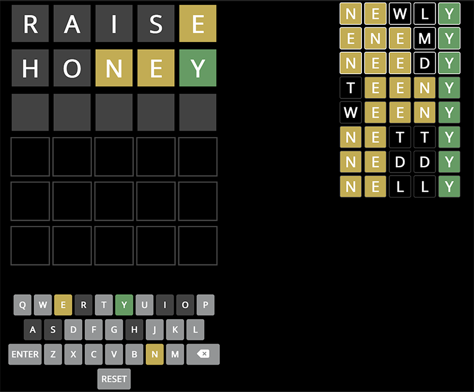

# WORDLE SOLVER - node.js

Test the UI for this service on [jackace.com](https://www.jackace.com/games/wordle/solver/).

## Request Format

    // Format of JSON request

    {
        guesses: [{
            word: 'RAISE',
            matches: [
                0,
                2,
                0,
                0,
                0
            ]
            },
            {
            word: 'TANGO',
            matches: [
                0,
                2,
                0,
                0,
                0
            ]
            }
        ]
    }

## Response Format

    {
        "filteredWordsAllowedCount": 9,
        "filteredWordsOfficialCount": 1,
        "suggestionsAllowed": [{
            "word": "feese",
            "score": 14.875
        }, {
            "word": "leese",
            "score": 14.75
        }, {
            "word": "fesse",
            "score": 11.5
        }, {
            "word": "cesse",
            "score": 11.375
        }, {
            "word": "desse",
            "score": 11.375
        }, {
            "word": "gesse",
            "score": 11.375
        }, {
            "word": "jesse",
            "score": 11.375
        }, {
            "word": "peyse",
            "score": 10.5
        }, {
            "word": "temse",
            "score": 10.375
        }],
        "suggestionsOfficial": [{
            "word": "geese",
            "score": 1.75
        }],
        "letterStatuses": [0, -1, -1, -1, 2, -1, -1, 0, 0, -1, -1, -1, -1, 0, 0, -1, -1, 0, 2, -1, 0, -1, -1, -1, -1, -1]
    }

## Sample curl

### localhost:3000

    curl 'http://localhost:3000/wordle' -X POST -H 'Accept: application/json' -H 'Content-Type: application/json; charset=UTF-8' --data-raw '{"guesses":[{"word":"raise","matches":[0,0,0,2,2]}, {"word":"house","matches":[0,0,0,2,2]}, {"word":"sense","matches":[1,2,0,2,2]}]}'

### heroku

    curl 'https://jackace-wordle-solver.herokuapp.com/wordle' -X POST -H 'Accept: application/json' -H 'Content-Type: application/json; charset=UTF-8' --data-raw '{"guesses":[{"word":"raise","matches":[0,0,0,2,2]}, {"word":"house","matches":[0,0,0,2,2]}, {"word":"sense","matches":[1,2,0,2,2]}]}'
